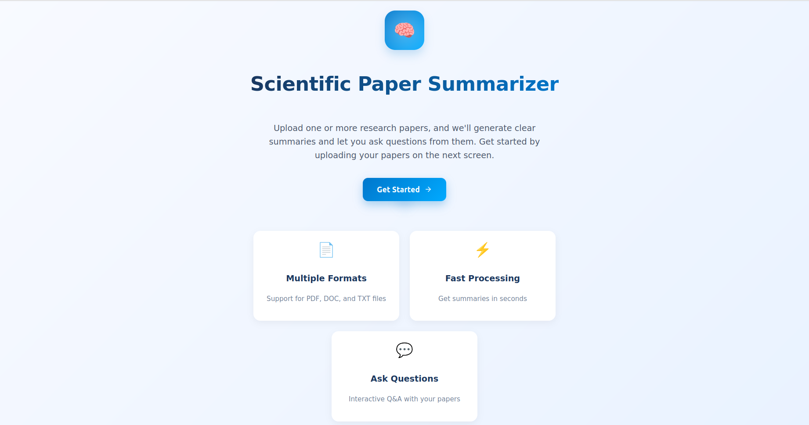
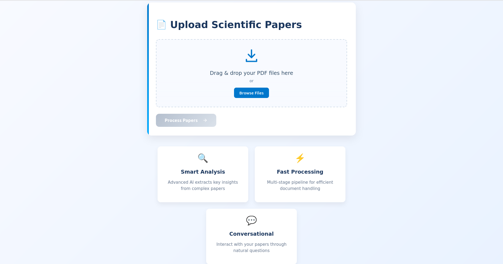
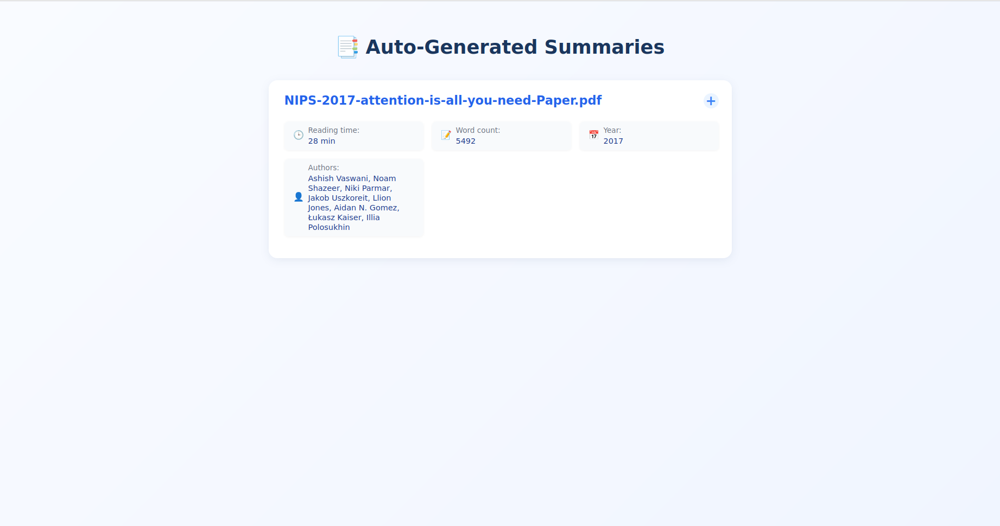
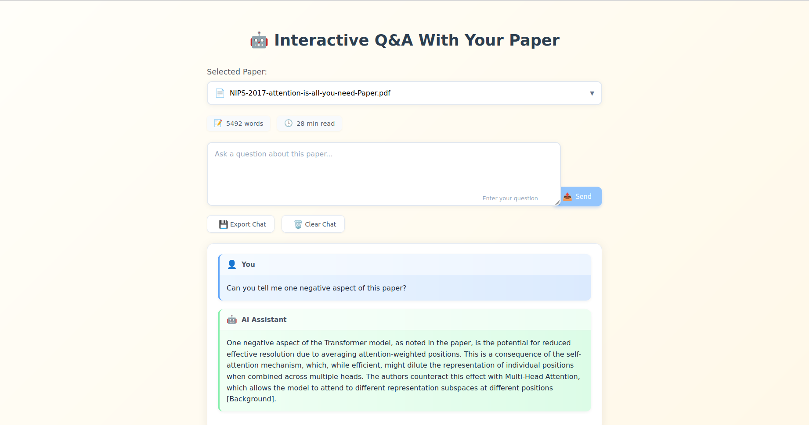

# 🧠 Scientific Paper Assistant

**The goal of this project is to help users quickly grasp key insights from research papers without having to read them in full — by letting an intelligent assistant summarize content and answer questions contextually.**

An AI-powered web app that allows researchers and students to:

- Upload scientific papers (PDFs)
- Automatically generate structured summaries
- Ask contextual questions about the paper using GPT-4o
- Track citations and section references
- View estimated reading time, metadata, and more

---

## ✨ Features

- 📄 Upload one or multiple PDF papers
- 🧠 Automatic summarization (Introduction, Methods, Results, Conclusion)
- 💬 Q&A with GPT-4o (frontend-only, using OpenAI API)
- 🔍 Simulated citation tracking via section-aware prompts
- ⏱️ Estimated reading time & word count
- 📅 Metadata extraction (author, year)
- 📂 Export Q&A as `.txt` file
- ♻️ Clear chat history per paper

---

## 📸 Screenshots
### Welcome Screen
> 
### Upload Your Document Here
> 
### Observe Your Paper Summary
> 
### Ask Questions About The Paper
> 

---

## 🛠 Tech Stack

- **Frontend:** React
- **LLM:** OpenAI GPT-4o
- **PDF Parsing:** pdfjs-dist
- **UI:** Custom CSS + modern layouts

---

## 🚀 Getting Started

### 1. Clone the Repo

```bash
git clone https://github.com/your-username/scientific-paper-assistant.git
cd scientific-paper-assistant
```

### 2. Install Dependencies

```bash
npm install
```

### 3. Add OpenAI Key

Create a .env file in the root:

```bash
REACT_APP_OPENAI_API_KEY=your-openai-key-here
```

### 4. Start the App

```bash
npm run dev
```

The app will be live at: http://localhost:5173

### 📁 Folder Structure
```bash
src/
├── components/
│ ├── IntroScreen.js
│ ├── UploadScreen.js
│ ├── SummaryScreen.js
│ └── QAScreen.js
├── utils/
│ ├── pdfUtils.js
│ └── openaiUtils.js
├── App.jsx
├── main.jsx
└── index.css
```
### 📌 Future Enhancements

- 🧮 Equation rendering with KaTeX
- 🖼 Image extraction and figure analysis
- 🔍 Vector-based chunk retrieval and citations
- ☁️ Backend API for larger document indexing

### 📄 License

MIT License. Open to contributions and collaboration.
